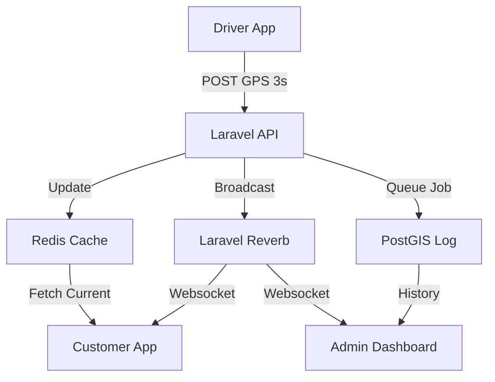
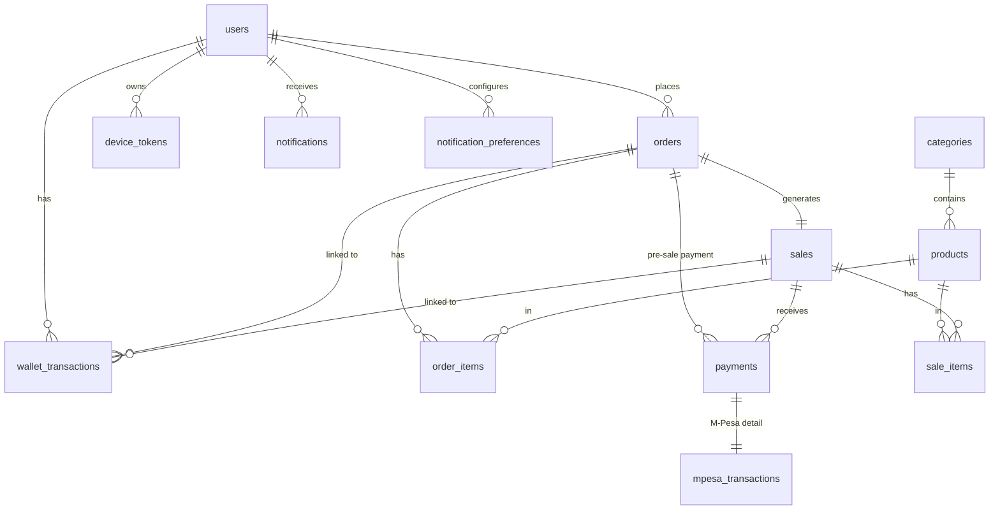

# EasyBuy – Smart Logistics & Unified Shopping

**Smart shopping, simplified.**

EasyBuy is an ultra-modern e-commerce and logistics platform designed for speed, reliability, and real-time visibility. Originally a robust shop management system, it now features a state-of-the-art **Delivery Tracking Engine** built on Laravel Reverb and Redis, providing sub-3-second location updates for a seamless "Uber Eats" style experience.

---

## Tech Stack

### Backend (Logistics & API)

| Layer                | Technology          | Version | Purpose                                                     |
| -------------------- | ------------------- | ------- | ----------------------------------------------------------- |
| **Framework**        | Laravel             | 12.x    | Main API, Business Logic, and Admin Panel                   |
| **Real-time Server** | Laravel Echo Server | 1.x     | Node.js based WebSocket server for live location broadcasts |
| **Cache / Queue**    | Redis               | 7.x     | High-speed location caching & async job processing          |
| **Database**         | MySQL               | 8+      | Relational data and geospatial storage for route history    |
| **Monitoring**       | Laravel Horizon     | 5.x     | Real-time queue dashboard for background operations         |
| **Auth & ACL**       | Spatie Permission   | 6.x     | RBAC (Customer, Rider, Merchant, Admin)                     |

---

## 📦 Key Laravel Packages

To power the delivery engine, we leverage several industry-standard Laravel packages. Here is why they are essential:

### 1. **laravel-echo-server** (WebSocket Server)

**Purpose**: A Node.js server that broadcasts events over WebSockets.

- It runs alongside Laravel, connecting to Redis to listen for events published by your API.
- **Why it matters**: It enables real-time bidirectional communication between the server and the app, allowing us to "push" location updates to customers seamlessly.

### 2. **predis/predis** (Redis Client)

**Purpose**: A flexible and feature-complete Redis client for PHP.

- **Why it matters**: It is the "glue" that connects Laravel to the Redis server. We use it for ultra-fast caching of current rider locations and as the primary transport for our WebSocket events and background queues.

### 3. **laravel/horizon** (Queue Monitoring)

**Purpose**: A beautiful dashboard and code-driven configuration for your Redis-powered queues.

- **Why it matters**: Horizon allows us to monitor our background jobs (like saving location history to PostGIS or sending push notifications) in real-time. If a job fails, Horizon makes it easy to see exactly why and retry it.

### 4. **spatie/laravel-permission** (Roles & Permissions)

**Purpose**: Managing user roles and permissions in a database.

- **Why it matters**: It handles the logic for our different user types: `customer`, `rider`, and `admin`. It ensures that only authorized riders can update locations and only admins can assign orders.

### 5. **laravel-notification-channels/fcm** (Firebase Push Notifications)

**Purpose**: Integrating Firebase Cloud Messaging (FCM) into Laravel's notification system.

- **Why it matters**: This is how we notify the React Native app when a new order is assigned or a delivery status changes. It works even when the app is closed or in the background.

---

### Frontend (User Experience)

- **Mobile**: React Native (Expo) — Shared app for Customers and Drivers (Dynamic Mode).
- **Styling**: Tailwind CSS & React Native Paper.
- **Maps**: React Native Maps + Google Directions/Distance Matrix API.

---

## Core Features

### 🚀 Real-time Delivery Tracking

powered by **Laravel Echo Server**, the platform provides real-time movement updates of riders.

- **Driver Mode**: Background GPS tracking every 3 seconds while on active delivery.
- **Customer Map**: Smooth, real-time pin movement and live ETA updates.

### 📦 Unified Order Management

- **Manual Dispatch**: Admins assign orders to available riders via a central dashboard.
- **Dual Fulfillment**: Support for both **Shop Pickup** (QR verified) and **Home Delivery**.
- **Hybrid Payments**: Integrated M-Pesa (Daraja API) and Card payments.

### 🌐 Multi-Mode App Interface

The React Native app dynamically switches interfaces based on user roles:

- **Customer**: Browse products, track orders, manage profile.
- **Rider**: "Go Online" toggle, delivery dashboard, turn-by-turn navigation data.

---

## Technical Deep Dive: The Real-time Engine

### Architecture Diagram



### Laravel Echo Server & Redis Sub-system

Real-time tracking uses a two-channel approach for maximum efficiency:

1. **The Pulse**: The Driver app POSTs GPS coordinates to a Laravel endpoint.
2. **The Cache**: Laravel immediately updates a Redis key `driver:{id}:location` for super-fast O(1) lookups.
3. **The Broadcast**: Simultaneously, a `DriverLocationUpdated` event is broadcast to Redis, which **Laravel Echo Server** picks up and pushes to the React Native app.
4. **The Log (Async)**: Heavy writing to the database is **offloaded to Redis**. This means the API doesn't wait for the slow database write; instead, it pushes a "job" into a Redis queue. A background worker (Horizon) picks this up a few milliseconds later to save it to MySQL. This keeps the driver's app super snappy.

---

## 🌍 Google Maps & Location Setup

To enable tracking and routing, the React Native app needs a Google Cloud Project with Billing Enabled.

### 1. Enable Required APIs (Google Cloud Console)

1. **Directions API**: Calculates turn-by-turn routes for the rider.
2. **Distance Matrix API**: Calculates dynamic ETAs based on traffic.
3. **Maps SDK for Android**: Renders the map natively on Android devices.
4. **Maps SDK for iOS**: Renders the map natively on iOS devices.

### 2. Generate and Secure API Keys

1. Navigate to **APIs & Services > Credentials** in Google Cloud.
2. Create an **API Key**.
3. **Important**: Restrict the key's usage purely to iOS/Android Apps using your `app.json` package name (`com.easybuy.app`) and SHA-1 certificate fingerprints to prevent quota theft.

### 3. Configure React Native

In `client/app.json`, confirm the Location permissions are present:

```json
"android": {
  "permissions": [
    "ACCESS_COARSE_LOCATION",
    "ACCESS_FINE_LOCATION"
  ],
  "config": {
    "googleMaps": {
      "apiKey": "AIzaSyYourRestrictedMapKeyHere..."
    }
  }
}
```

---

## 🔐 Google Social Authentication Setup

EasyBuy allows users to log in securely with Google.

### 1. Create OAuth Credentials

1. In Google Cloud Console, navigate to **APIs & Services > Credentials**.
2. Create **OAuth Client IDs**. You will need two types:
   - A **Web Application Client ID**. (Used by Laravel for backend token verification).
   - An **Android Client ID**. (Used by Expo to trigger the native login modal).

### 2. Connect the React Native App

Update the Expo environment variables in `client/.env` using the generated IDs:

```env
EXPO_PUBLIC_GOOGLE_WEB_CLIENT_ID="1084441530775-9o3gpciehs0afp7ruj5emukedt6plgb0.apps.googleusercontent.com"
EXPO_PUBLIC_GOOGLE_ANDROID_CLIENT_ID="1084441530775-nh7rsr5j2ouv0utp56kge90962rotnnc.apps.googleusercontent.com"
```

### 3. Connect the Laravel Backend

Ensure the Web Client ID matches the backend so Laravel can verify incoming tokens. In `easybuy/.env`:

```env
GOOGLE_CLIENT_ID=1084441530775-9o3gpciehs0afp7ruj5emukedt6plgb0.apps.googleusercontent.com
GOOGLE_CLIENT_SECRET=your_backend_secret_here
```

### 4. Server-Side Configuration (For Production)

When you deploy your backend to Ubuntu, you **must populate the `.env` file** on your server with the API keys and Client IDs so it matches your local environment.

Add the following to your production `/var/www/easybuy/.env`:

#### A. Google Auth Configuration

Laravel needs the Client ID and Secret to verify tokens sent by the mobile app:

```env
GOOGLE_CLIENT_ID=1084441530775-9o3gpciehs0afp7ruj5emukedt6plgb0.apps.googleusercontent.com
GOOGLE_CLIENT_SECRET=your_production_backend_secret
```

#### B. Echo Server Configuration

Ensure your `laravel-echo-server.json` file on the server has the correct `authHost` pointing to your domain:

```json
{
  "authHost": "https://api.easybuy.com",
  "database": "redis",
  "databaseConfig": {
    "redis": {
      "port": "6379",
      "host": "127.0.0.1",
      "password": "your_redis_password"
    }
  }
}
```

---

### `online_status` Lifecycle

Rider availability is handled via a persistent heartbeat:

- When a rider toggles "Online", the app sends a ping every 30s.
- The server stores the `last_seen_at` in Redis.
- A scheduled task or a Redis TTL scan automatically moves inactive riders to "Offline" status after 2 minutes of silence.

---

## 🛠️ Developer & Production Setup

### 1. Local Development (Standard)

```bash
# Terminal 1: Laravel Server
php artisan serve

# Terminal 2: Real-time & Queues
php artisan reverb:start
php artisan horizon

# Terminal 3: Frontend Assets
npm run dev
```

### 2. Connect React Native to Laravel API

By default, Expo uses `localhost`, but your phone or emulator cannot reach `localhost` because it has its own isolated network.

- **Local Network**: Connect both your phone and PC to the same Wi-Fi. Find your PC's IPv4 address (e.g., `192.168.1.50`).
- **Start Laravel**: Bind the server to your IP using `php artisan serve --host=0.0.0.0 --port=8000`.
- **Configure Expo**: In `client/.env`, set `EXPO_PUBLIC_API_URL=http://<YOUR_PC_IP>:8000/api`.

> [!WARNING]
> Android and iOS strictly enforce HTTPS for external traffic in Production. If you deploy your API, you **MUST** configure an SSL Certificate (e.g., Let's Encrypt), otherwise the mobile app will throw "Network Request Failed" errors.

---

### 3. Production Deployment (Ubuntu 24.04 VPS)

For a real-world launch, deploy your Laravel backend to a VPS (e.g., DigitalOcean Droplet, AWS EC2, or Linode).

#### A. Install the LEMP Stack

Secure your server and install the core dependencies:

```bash
sudo apt update && sudo apt upgrade -y
sudo apt install nginx redis-server mysql-server php8.3-fpm php8.3-cli php8.3-mysql php8.3-redis supervisor unzip git curl npm -y
sudo npm install -g laravel-echo-server
```

#### B. Nginx Reverse Proxy (Critical for APIs)

Configure Nginx to handle both the API and the Echo Server WebSocket.

Create `/etc/nginx/sites-available/api.easybuy.com`:

```nginx
server {
    listen 80;
    server_name api.easybuy.com;
    root /var/www/easybuy/public;
    index index.php;

    # 1. Route standard API traffic to PHP-FPM
    location / {
        try_files $uri $uri/ /index.php?$query_string;
    }

    location ~ \.php$ {
        include snippets/fastcgi-php.conf;
        fastcgi_pass unix:/var/run/php/php8.3-fpm.sock;
    }

    # 2. Route WebSocket traffic directly to Laravel Echo Server
    location /socket.io {
        proxy_pass http://127.0.0.1:6001;
        proxy_http_version 1.1;
        proxy_set_header Upgrade $http_upgrade;
        proxy_set_header Connection "Upgrade";
        proxy_set_header Host $host;
    }
}
```

_Run `sudo ln -s /etc/nginx/sites-available/api.easybuy.com /etc/nginx/sites-enabled/` and `sudo systemctl restart nginx`._

#### C. Secure with SSL (Let's Encrypt)

React Native requires HTTPS in production.

```bash
sudo apt install certbot python3-certbot-nginx -y
sudo certbot --nginx -d api.easybuy.com
```

#### D. Keep Background Services Alive (Supervisor)

If your server reboots, your queue workers and WebSocket server must start automatically. Supervisor handles this.

Create `/etc/supervisor/conf.d/easybuy.conf`:

```ini
[program:easybuy-horizon]
process_name=%(program_name)s
command=php /var/www/easybuy/artisan horizon
autostart=true
autorestart=true
user=www-data
redirect_stderr=true
stdout_logfile=/var/www/easybuy/storage/logs/horizon.log

[program:easybuy-echo]
process_name=%(program_name)s
command=laravel-echo-server start
directory=/var/www/easybuy
autostart=true
autorestart=true
user=www-data
redirect_stderr=true
stdout_logfile=/var/www/easybuy/storage/logs/echo.log
```

_Run `sudo supervisorctl reread && sudo supervisorctl update && sudo supervisorctl start all`._

---

## 🗄️ Database Schema

> All tables follow Laravel conventions: `id` is an auto-incrementing `BIGINT UNSIGNED PRIMARY KEY`. `timestamps()` produces `created_at` and `updated_at` (`TIMESTAMP NULL`). `softDeletes()` produces `deleted_at` (`TIMESTAMP NULL`).

---

### `users`

| Column | Type | Constraints | Notes |
|---|---|---|---|
| `id` | bigint unsigned | PK, auto-increment | |
| `username` | varchar(255) | NOT NULL | Renamed from `name` |
| `first_name` | varchar(255) | NOT NULL | |
| `last_name` | varchar(255) | NOT NULL | |
| `email` | varchar(255) | UNIQUE, NOT NULL | |
| `email_verified_at` | timestamp | NULL | |
| `password` | varchar(255) | NULL | Nullable for social-login users |
| `phone_number` | varchar(255) | UNIQUE, NULL | |
| `gender` | enum | NULL | `male`, `female` |
| `role` | enum | DEFAULT `customer` | `admin`, `customer`, `transporter` |
| `wallet_balance` | decimal(10,2) | DEFAULT 0 | |
| `max_debt_limit` | decimal(10,2) | DEFAULT -5000 | |
| `profile_photo` | varchar(255) | NULL | |
| `national_id_number` | int | UNIQUE, NULL | |
| `date_of_birth` | date | NULL | |
| `provider` | varchar(255) | NULL | `google`, `facebook` |
| `provider_id` | varchar(255) | NULL | |
| `provider_token` | text | NULL | |
| `provider_refresh_token` | text | NULL | |
| `remember_token` | varchar(100) | NULL | |
| `created_at` / `updated_at` | timestamp | NULL | |

---

### `password_reset_tokens`

| Column | Type | Constraints |
|---|---|---|
| `email` | varchar(255) | PK |
| `token` | varchar(255) | NOT NULL |
| `created_at` | timestamp | NULL |

---

### `sessions`

| Column | Type | Constraints |
|---|---|---|
| `id` | varchar(255) | PK |
| `user_id` | bigint unsigned | NULL, INDEX → `users.id` |
| `ip_address` | varchar(45) | NULL |
| `user_agent` | text | NULL |
| `payload` | longtext | NOT NULL |
| `last_activity` | int | INDEX |

---

### `email_verification_codes`

| Column | Type | Constraints |
|---|---|---|
| `id` | bigint unsigned | PK |
| `email` | varchar(255) | INDEX |
| `code` | varchar(255) | NOT NULL |
| `created_at` | timestamp | NULL |

---

### `personal_access_tokens` *(Sanctum)*

| Column | Type | Constraints |
|---|---|---|
| `id` | bigint unsigned | PK |
| `tokenable_type` | varchar(255) | NOT NULL (morph) |
| `tokenable_id` | bigint unsigned | NOT NULL (morph) |
| `name` | text | NOT NULL |
| `token` | varchar(64) | UNIQUE |
| `abilities` | text | NULL |
| `last_used_at` | timestamp | NULL |
| `expires_at` | timestamp | NULL, INDEX |
| `created_at` / `updated_at` | timestamp | NULL |

---

### `categories`

| Column | Type | Constraints |
|---|---|---|
| `id` | bigint unsigned | PK |
| `name` | varchar(255) | UNIQUE |
| `is_active` | tinyint(1) | DEFAULT 1 |
| `created_at` / `updated_at` | timestamp | NULL |

---

### `products`

| Column | Type | Constraints | Notes |
|---|---|---|---|
| `id` | bigint unsigned | PK | |
| `name` | varchar(255) | UNIQUE | |
| `image_url` | varchar(500) | NULL | |
| `category_id` | bigint unsigned | FK → `categories.id` CASCADE, INDEX | |
| `description` | text | NULL | |
| `kilograms_in_stock` | decimal(8,3) | NULL | Total kg weight of one unit |
| `cost_price` | decimal(10,2) | NOT NULL | |
| `sale_price` | decimal(10,2) | NOT NULL | |
| `in_stock` | decimal(10,3) | DEFAULT 0 | Supports fractional kg quantities |
| `minimum_stock` | decimal(10,3) | NULL | Low-stock alert threshold |
| `is_active` | tinyint(1) | DEFAULT 1, INDEX | |
| `created_at` / `updated_at` | timestamp | NULL | |

---

### `orders`

| Column | Type | Constraints | Notes |
|---|---|---|---|
| `id` | bigint unsigned | PK | |
| `order_number` | varchar(255) | UNIQUE | |
| `user_id` | bigint unsigned | NULL, FK → `users.id` SET NULL, INDEX | |
| `order_status` | enum | DEFAULT `pending`, INDEX | `pending`, `confirmed`, `cancelled` |
| `payment_status` | enum | DEFAULT `pending`, INDEX | `pending`, `fully-paid`, `partially-paid`, `debt`, `failed` |
| `fulfillment_status` | enum | DEFAULT `pending`, INDEX | `pending`, `ready`, `picked_up` |
| `pickup_verification_code` | varchar(20) | NULL, INDEX | For QR verification |
| `pickup_qr_code` | varchar(255) | NULL | |
| `order_date` | date | NOT NULL, INDEX | |
| `order_time` | time | NOT NULL, INDEX | |
| `pickup_time` | datetime | NULL, INDEX | Scheduled pickup |
| `reminder_sent` | tinyint(1) | DEFAULT 0 | Pickup reminder flag |
| `cancelled_at` | datetime | NULL | |
| `cancellation_reason` | text | NULL | |
| `notes` | text | NULL | |
| `created_at` / `updated_at` | timestamp | NULL | |

---

### `order_items`

| Column | Type | Constraints | Notes |
|---|---|---|---|
| `id` | bigint unsigned | PK | |
| `order_id` | bigint unsigned | FK → `orders.id` CASCADE, INDEX | |
| `product_id` | bigint unsigned | FK → `products.id` CASCADE, INDEX | |
| `quantity` | int unsigned | DEFAULT 0 | Unit quantity |
| `kilogram` | decimal(8,3) | NULL | Weight for kg-based items |
| `unit_price` | decimal(10,2) | NOT NULL | Price snapshot at order time |
| `created_at` / `updated_at` | timestamp | NULL | |

---

### `sales`

| Column | Type | Constraints | Notes |
|---|---|---|---|
| `id` | bigint unsigned | PK | |
| `sale_number` | varchar(255) | UNIQUE, INDEX | |
| `order_id` | bigint unsigned | UNIQUE, FK → `orders.id` CASCADE, INDEX | 1-to-1 with order |
| `total_amount` | decimal(10,2) | NOT NULL | |
| `total_paid` | decimal(10,2) | DEFAULT 0 | Running sum of completed payments |
| `cost_amount` | decimal(10,2) | DEFAULT 0 | |
| `profit_amount` | decimal(10,2) | DEFAULT 0 | |
| `payment_status` | enum | DEFAULT `no-payment`, INDEX | `fully-paid`, `partial-payment`, `no-payment`, `overdue` |
| `fulfillment_status` | enum | DEFAULT `unfulfilled`, INDEX | `unfulfilled`, `fulfilled` |
| `due_date` | datetime | NULL, INDEX | Debt due date |
| `receipt_generated` | tinyint(1) | DEFAULT 0 | |
| `made_on` | datetime | NOT NULL, INDEX | |
| `fulfilled_at` | datetime | NULL, INDEX | When customer picked up |
| `created_at` / `updated_at` | timestamp | NULL | |
| `deleted_at` | timestamp | NULL | Soft deletes |

---

### `sale_items`

| Column | Type | Constraints | Notes |
|---|---|---|---|
| `id` | bigint unsigned | PK | |
| `sale_id` | bigint unsigned | FK → `sales.id` CASCADE, INDEX | |
| `product_id` | bigint unsigned | FK → `products.id` CASCADE, INDEX | |
| `quantity` | int unsigned | DEFAULT 0 | |
| `kilogram` | decimal(8,3) | NULL | |
| `unit_price` | decimal(10,2) | NOT NULL | |
| `cost_price` | decimal(10,2) | NOT NULL | |
| `created_at` / `updated_at` | timestamp | NULL | |

---

### `payments`

| Column | Type | Constraints | Notes |
|---|---|---|---|
| `id` | bigint unsigned | PK | |
| `payment_number` | varchar(255) | UNIQUE, INDEX | |
| `order_id` | bigint unsigned | NULL, FK → `orders.id` CASCADE, INDEX | Pre-sale payment link |
| `sale_id` | bigint unsigned | NULL, FK → `sales.id` CASCADE, INDEX | |
| `payment_method` | enum | DEFAULT `cash`, INDEX | `mpesa`, `cash`, `card` |
| `amount` | decimal(10,2) | NOT NULL | |
| `mpesa_transaction_id` | varchar(255) | NULL | |
| `stripe_payment_intent_id` | varchar(255) | NULL | |
| `status` | enum | DEFAULT `pending`, INDEX | `pending`, `completed`, `failed`, `refunded` |
| `reference` | varchar(255) | NULL | |
| `notes` | text | NULL | |
| `paid_at` | datetime | NOT NULL, INDEX | |
| `refunded_at` | datetime | NULL | |
| `refund_amount` | decimal(10,2) | NULL | |
| `created_at` / `updated_at` | timestamp | NULL | |
| `deleted_at` | timestamp | NULL | Soft deletes |

---

### `mpesa_transactions`

| Column | Type | Constraints |
|---|---|---|
| `id` | bigint unsigned | PK |
| `payment_id` | bigint unsigned | UNIQUE, FK → `payments.id` CASCADE, INDEX |
| `transaction_id` | varchar(255) | UNIQUE, INDEX |
| `checkout_request_id` | varchar(255) | UNIQUE, INDEX |
| `merchant_request_id` | varchar(255) | NULL |
| `account_reference` | varchar(255) | NULL |
| `amount` | decimal(10,2) | NOT NULL |
| `phone_number` | varchar(15) | NOT NULL |
| `transaction_desc` | varchar(255) | NULL |
| `status` | enum | DEFAULT `pending`, INDEX – `pending`, `success`, `failed`, `cancelled` |
| `mpesa_receipt_number` | varchar(255) | NULL |
| `transaction_date` | datetime | NULL |
| `result_code` | int | NULL |
| `result_desc` | varchar(255) | NULL |
| `callback_data` | json | NULL |
| `created_at` / `updated_at` | timestamp | NULL |

---

### `wallet_transactions`

| Column | Type | Constraints | Notes |
|---|---|---|---|
| `id` | bigint unsigned | PK | |
| `user_id` | bigint unsigned | FK → `users.id` CASCADE, INDEX | |
| `order_id` | bigint unsigned | NULL, FK → `orders.id` SET NULL, INDEX | |
| `sale_id` | bigint unsigned | NULL, FK → `sales.id` SET NULL, INDEX | |
| `amount` | decimal(10,2) | NOT NULL | Positive = credit, Negative = debit |
| `type` | enum | NOT NULL, INDEX | `overpayment`, `underpayment`, `order_payment`, `refund`, `adjustment` |
| `description` | text | NULL | |
| `created_at` / `updated_at` | timestamp | NULL, INDEX | |

---

### `device_tokens`

| Column | Type | Constraints |
|---|---|---|
| `id` | bigint unsigned | PK |
| `user_id` | bigint unsigned | FK → `users.id` CASCADE, INDEX |
| `device_token` | varchar(255) | UNIQUE, INDEX |
| `platform` | enum | DEFAULT `android` – `ios`, `android` |
| `created_at` / `updated_at` | timestamp | NULL |

---

### `notifications`

| Column | Type | Constraints | Notes |
|---|---|---|---|
| `id` | bigint unsigned | PK | |
| `user_id` | bigint unsigned | NULL, FK → `users.id` CASCADE, INDEX | NULL = admin broadcast |
| `type` | enum | NOT NULL, INDEX | `order_placed`, `order_confirmed`, `order_cancelled`, `debt_warning_2days`, `debt_warning_admin_2days`, `debt_overdue`, `debt_overdue_admin`, `payment_received`, `payment_received_admin`, `sale_fully_paid`, `low_stock_alert`, `refund_processed`, `new_product_available` |
| `title` | varchar(255) | NOT NULL | |
| `message` | text | NOT NULL | |
| `data` | json | NULL | Deep-link payload (order_id, sale_id, etc.) |
| `priority` | enum | DEFAULT `medium` | `low`, `medium`, `high` |
| `read_at` | timestamp | NULL, INDEX | |
| `archived_at` | timestamp | NULL | |
| `created_at` / `updated_at` | timestamp | NULL, INDEX | |

---

### `notification_preferences`

| Column | Type | Constraints |
|---|---|---|
| `id` | bigint unsigned | PK |
| `user_id` | bigint unsigned | FK → `users.id` CASCADE, INDEX |
| `type` | enum | Same values as `notifications.type` |
| `enabled` | tinyint(1) | DEFAULT 1 |
| `push_enabled` | tinyint(1) | DEFAULT 1 |
| `created_at` / `updated_at` | timestamp | NULL |
| — | UNIQUE | (`user_id`, `type`) |

---

### Framework / Queue Tables

#### `cache`
| Column | Type |
|---|---|
| `key` | varchar(255) PK |
| `value` | mediumtext |
| `expiration` | int |

#### `cache_locks`
| Column | Type |
|---|---|
| `key` | varchar(255) PK |
| `owner` | varchar(255) |
| `expiration` | int |

#### `jobs`
| Column | Type |
|---|---|
| `id` | bigint unsigned PK |
| `queue` | varchar(255) INDEX |
| `payload` | longtext |
| `attempts` | tinyint unsigned |
| `reserved_at` | int unsigned NULL |
| `available_at` | int unsigned |
| `created_at` | int unsigned |

#### `job_batches`
| Column | Type |
|---|---|
| `id` | varchar(255) PK |
| `name` | varchar(255) |
| `total_jobs` | int |
| `pending_jobs` | int |
| `failed_jobs` | int |
| `failed_job_ids` | longtext |
| `options` | mediumtext NULL |
| `cancelled_at` | int NULL |
| `created_at` | int |
| `finished_at` | int NULL |

#### `failed_jobs`
| Column | Type |
|---|---|
| `id` | bigint unsigned PK |
| `uuid` | varchar(255) UNIQUE |
| `connection` | text |
| `queue` | text |
| `payload` | longtext |
| `exception` | longtext |
| `failed_at` | timestamp DEFAULT CURRENT_TIMESTAMP |

---

### Entity Relationship Overview



---

© 2026 EasyBuy Engineering Team. Built for scale and performance.
